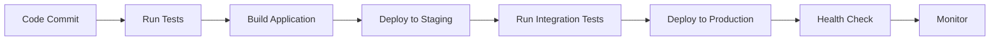

## Deployment Options

The Furniture Store Backend is a Flask application that can be deployed using various methods depending on your infrastructure requirements.

### Traditional Server Deployment

Deploy directly on a Linux server using a WSGI server (Gunicorn or uWSGI) behind a reverse proxy like Nginx. This approach provides:

- Full control over the server environment
- Direct access to system resources
- Custom security configurations
- Cost-effective for dedicated infrastructure

**Best for**: Organizations with existing server infrastructure or specific compliance requirements.

### Docker Containerization

Package the application in a Docker container for consistent deployment across environments:

```dockerfile
FROM python:3.11-slim

WORKDIR /app

COPY requirements.txt .
RUN pip install --no-cache-dir -r requirements.txt

COPY . .

EXPOSE 5000

CMD ["gunicorn", "-w", "4", "-b", "0.0.0.0:5000", "run:app"]
```

**Best for**: Microservices architecture, container orchestration platforms, and consistent development-to-production pipelines.

### Cloud Platform Deployment

**AWS Elastic Beanstalk**
- Automated capacity provisioning
- Load balancing and auto-scaling
- Integrated with RDS for database
- Simple deployment with `eb deploy`

**Google Cloud Run**
- Serverless container deployment
- Automatic scaling to zero
- Pay-per-use pricing model
- Built-in HTTPS and custom domains

**Heroku**
- Git-based deployment workflow
- Built-in MySQL add-ons
- Easy environment variable management
- Automatic HTTPS

**Best for**: Rapid deployment, managed infrastructure, and applications with variable traffic.

## Environment Considerations

### Development Environment

- Uses Flask development server (`flask run` or `python run.py`)
- Debug mode enabled for detailed error messages
- SQLite or local MySQL database
- Default SECRET_KEY allowed (see config.py:27)

### Staging Environment

- Mirrors production configuration
- Uses production-grade WSGI server
- Separate database instance
- Real SECRET_KEY required
- Testing ground for deployment procedures

### Production Environment

- **Never** use Flask development server
- Production WSGI server (Gunicorn/uWSGI) required
- Secure SECRET_KEY mandatory (see config.py:22-27)
- Production database with backups
- HTTPS enforced
- Environment variables secured
- Logging and monitoring enabled

## Database Deployment

### Database Configuration

The application uses SQLAlchemy with MySQL/PyMySQL (see config.py:15-16):

```python
SQLALCHEMY_DATABASE_URI = (
    f"mysql+pymysql://{DB_USER}:{DB_PASSWORD}@{DB_HOST}:{DB_PORT}/{DB_NAME}"
)
```

### Production Database Setup

<Steps>
  <Step title="Provision Database">
    Create a MySQL database instance:
    - **Cloud providers**: AWS RDS, Google Cloud SQL, Azure Database
    - **Self-hosted**: MySQL 8.0+ on dedicated server
    - Minimum 2GB RAM recommended for production
  </Step>

  <Step title="Configure Security">
    - Create dedicated database user with limited privileges
    - Enable SSL/TLS connections
    - Restrict network access to application servers only
    - Set strong password (minimum 16 characters)
  </Step>

  <Step title="Set Environment Variables">
    Configure database connection:
    ```bash
    DB_USER=furniture_app
    DB_PASSWORD=<strong-password>
    DB_HOST=db.example.com
    DB_PORT=3306
    DB_NAME=furniture_store_prod
    ```
  </Step>

  <Step title="Run Migrations">
    Apply database schema using Flask-Migrate:
    ```bash
    flask db upgrade
    ```
  </Step>
</Steps>

### Database Connection Pool

For production, configure SQLAlchemy connection pooling in config.py:

```python
SQLALCHEMY_ENGINE_OPTIONS = {
    'pool_size': 10,
    'pool_recycle': 3600,
    'pool_pre_ping': True,
    'max_overflow': 20
}
```

### Migration Strategy

- **Development**: Run migrations manually with `flask db upgrade`
- **Production**: Include migration step in deployment pipeline
- **Rollback plan**: Test `flask db downgrade` procedures
- **Backup first**: Always backup database before migrations

## Security Checklist

Before deploying to production, verify these security requirements:

<AccordionGroup>
  <Accordion title="Environment Variables">
    <Check>SECRET_KEY set to cryptographically random value</Check>
    <Check>Database credentials stored in environment variables</Check>
    <Check>.env file excluded from version control</Check>
    <Check>No hardcoded secrets in code</Check>
  </Accordion>

  <Accordion title="Application Security">
    <Check>FLASK_ENV set to production (config.py:25)</Check>
    <Check>Debug mode disabled</Check>
    <Check>CSRF protection enabled (uses flask_wtf.csrf - see app/__init__.py:27)</Check>
    <Check>HTTPS enforced for all traffic</Check>
    <Check>Secure session cookies configured</Check>
  </Accordion>

  <Accordion title="Database Security">
    <Check>Database user has minimum required privileges</Check>
    <Check>SSL/TLS enabled for database connections</Check>
    <Check>Database not publicly accessible</Check>
    <Check>Regular automated backups configured</Check>
  </Accordion>

  <Accordion title="Server Security">
    <Check>Firewall configured (only necessary ports open)</Check>
    <Check>SSH key-based authentication only</Check>
    <Check>Regular security updates applied</Check>
    <Check>Fail2ban or similar intrusion prevention</Check>
  </Accordion>

  <Accordion title="Monitoring">
    <Check>Application logging configured</Check>
    <Check>Error tracking system integrated</Check>
    <Check>Performance monitoring enabled</Check>
    <Check>Uptime monitoring configured</Check>
  </Accordion>
</AccordionGroup>

## Deployment Workflow

Recommended deployment workflow:



1. **Code commit**: Push changes to version control
2. **Run tests**: Automated testing pipeline
3. **Build**: Create deployment package or container
4. **Staging deployment**: Deploy to staging environment
5. **Integration tests**: Verify functionality in staging
6. **Production deployment**: Deploy to production servers
7. **Health check**: Verify application is running
8. **Monitor**: Continuous monitoring for issues

## Next Steps

<CardGroup cols={2}>
  <Card title="Production Setup" icon="server" href="/deployment/production">
    Detailed production deployment guide with WSGI and Nginx configuration
  </Card>
  <Card title="Environment Setup" icon="gear" href="/environment-setup">
    Configure environment variables and application settings
  </Card>
</CardGroup>